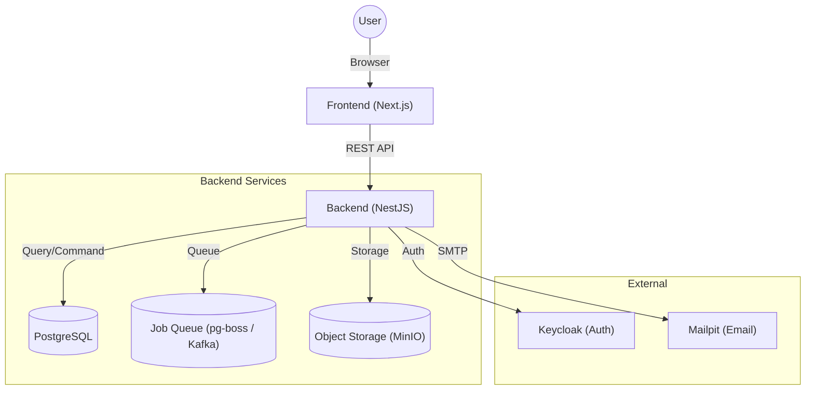

# Flow Craft

**Flow Craft** は、柔軟なフォーム設計と高度なワークフロー制御を可能にする、モダンなノーコード/ローコード ワークフロープラットフォームです。
直感的なドラッグ＆ドロップ操作で業務アプリを作成し、複雑な承認プロセスも視覚的に定義できます。

## 🚀 主な機能

### 1. フォームデザイナー
- **ドラッグ＆ドロップ**: テキスト、数値、日付、選択肢などのコンポーネントを自由に配置
- **グリッドレイアウト**: 柔軟なレイアウト調整が可能
- **バリデーション**: 必須チェック、文字数制限などをGUIで設定

### 2. フローデザイナー
- **ノードベース編集**: 直感的なGUIで承認フローを設計
- **多彩なノード**: 承認、差戻し、条件分岐、並列処理、API呼び出し等
- **可視化**: 申請の現在地やルートを視覚的に把握

### 3. アプリケーション管理
- **バージョン管理**: フォームとフローの定義をバージョンごとに保存・復元
- **ステータス管理**: 下書き、公開、アーカイブのライフサイクル管理
- **タグ機能**: 用途や部署ごとにアプリを分類・検索

### 4. ワークフロー実行エンジン
- **ステータス遷移**: 定義に基づいた厳密なステータス管理
- **履歴記録**: 誰がいつ何をしたかを全て記録（証跡管理）
- **タスク管理**: ユーザーごとの承認タスク一覧表示

## 🛠 技術スタック

### Frontend
- **Framework**: [Next.js](https://nextjs.org/) (App Router)
- **UI Context**: React
- **Component Lib**: Material UI (MUI)
- **Visual Editors**: 
  - [React Flow](https://reactflow.dev/) (フロー図)
  - [React Grid Layout](https://github.com/react-grid-layout/react-grid-layout) (フォーム配置)
- **State Management**: React Query (TanStack Query)

### Backend
- **Framework**: [NestJS](https://nestjs.com/)
- **Language**: TypeScript
- **Database**: PostgreSQL
- **ORM**: Prisma
- **API Style**: REST API

### Infrastructure
- **Containerization**: Docker / Docker Compose
- **Authentication**: Keycloak (Optional/Integrated)

## 🏗 アーキテクチャ

本システムは、フロントエンドとバックエンドを分離した疎結合なアーキテクチャを採用しています。



## 📦 ディレクトリ構成

- **[frontend/](./frontend/README.md)**: Next.js によるフロントエンドアプリケーション
- **[backend/](./backend/README.md)**: NestJS によるバックエンド API アプリケーション
- `keycloak/`: 認証サーバー設定
- `docker-compose.yml`: ローカル開発環境の構成定義

詳細な設計や開発手法については、各ディレクトリの README を参照してください。

## 🏁 クイックスタート

Docker環境があれば、すぐにローカルで動作確認が可能です。

### 前提条件
- Docker Desktop
- Docker Compose

### 開発ワークフロー（推奨: Hybrid Mode）
本プロジェクトでは、開発効率向上のため「インフラはDocker、アプリはホストマシン」で動かすハイブリッド構成を推奨しています。

1. **インフラの起動**
   DB, Keycloak, MinIOなどを起動します（Backend/Frontendコンテナは起動しません）。
   ```bash
   docker compose up -d
   ```

2. **バックエンドの起動**
   ```bash
   cd backend
   npm run start:dev
   ```
   - API: http://localhost:8080/api
   - Swagger: http://localhost:8080/api/docs

3. **フロントエンドの起動**
   ```bash
   cd frontend-new
   npm run dev
   ```
   - App: http://localhost:3000

### 補足: 完全Dockerモード
従来の「すべてDockerで動かす」方法も可能です。その場合は `app` プロファイルを指定します。
```bash
docker compose --profile app up -d
```

## 🔧 環境のメンテナンス

### 環境の完全初期化
データベースや設定を含めて環境を完全にリセットしたい場合（ボリュームの削除）、以下のコマンドを実行します。
**注意: データベース内の全データが削除されます。**

```bash
docker-compose down -v
docker-compose up -d --build
```

### 依存関係（node_modules）の更新
`package.json` を変更した場合など、依存ライブラリを更新するには以下を実行します。
Node.jsのモジュールはDockerボリューム内に保存されているため、再ビルドとボリュームの更新が必要です。

```bash
# コンテナを停止し、匿名ボリューム（node_modules等）を再作成して起動
docker-compose down
docker-compose up -d --build -V
```

### Queue Mode (Kafka / pg-boss)
デフォルトではPostgreSQLベースの `pg-boss` を使用しますが、大規模環境向けに Kafka モードもサポートしています。

**Kafkaモードでの起動:**
環境変数 `QUEUE_TYPE` を指定して起動します。
```bash
QUEUE_TYPE=kafka docker compose --profile kafka up -d
```

### Elasticsearch Mode (Optional)
デフォルトのPostgreSQL検索に加え、全文検索エンジンElasticsearchを利用可能です。

**Elasticsearchモードでの起動:**
環境変数 `SEARCH_MODE` を指定して起動します。
```bash
SEARCH_MODE=elasticsearch docker compose --profile es up -d
```

## 📝 ライセンス

Copyright (c) 2026 kenichi-33. All rights reserved.   
無断での複製・改変・再配布を禁じます。   
詳細は [LICENSE](./LICENSE) ファイルをご確認ください。   
