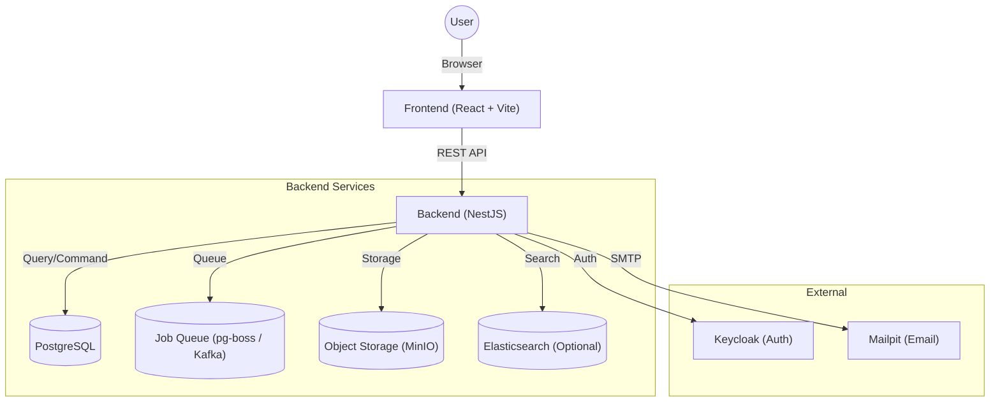

# Flow Craft

**Flow Craft** は、柔軟なフォーム設計と高度なワークフロー制御を可能にする、モダンなノーコード/ローコード ワークフロープラットフォームです。
直感的なドラッグ＆ドロップ操作で業務アプリを作成し、複雑な承認プロセスも視覚的に定義できます。

## 🚀 主な機能

### 1. フォームデザイナー
- **ドラッグ＆ドロップ**: テキスト、数値、日付、選択肢などのコンポーネントを自由に配置
- **グリッドレイアウト**: 柔軟なレイアウト調整が可能
- **バリデーション**: 必須チェック、文字数制限などをGUIで設定
### 1. フォームデザイナー
- **ドラッグ＆ドロップ**: テキスト、数値、日付、選択肢などのコンポーネントを自由に配置
- **グリッドレイアウト**: 柔軟なレイアウト調整が可能
- **バリデーション**: 必須チェック、文字数制限などをGUIで設定
- **AI自動生成**: 自然言語のプロンプトからフォーム定義を自動生成

#### 対応コンポーネント一覧

**入力系**

| コンポーネント | 説明 | 設定可能な機能 |
|---|---|---|
| `テキスト` | 1行テキスト入力 | 必須、読取専用、入力規則(正規表現)、配置 |
| `テキストエリア` | 複数行の文章入力 | 必須、読取専用、配置 |
| `数値` | 数値のみ入力 | 必須、読取専用、配置 |
| `金額` | 通貨フォーマットでの入力 | 必須、読取専用、配置 |
| `自動計算` | 他フィールドの値計算 | 計算式(四則演算)、配置 |
| `メール` | メールアドレス形式チェック付き入力 | 必須、読取専用、入力規則(正規表現)、配置 |
| `電話番号` | 電話番号入力 | 必須、読取専用、入力規則(正規表現)、配置 |
| `URL` | URL形式チェック付き入力 | 必須、読取専用、入力規則(正規表現)、配置 |
| `日付` | カレンダー選択 | 必須、読取専用、時刻を含める |
| `ファイル` | ファイルアップロード | 必須、読取専用、許可拡張子、最大サイズ、複数可/不可、最大ファイル数 |

**選択系**

| コンポーネント | 説明 | 設定可能な機能 |
|---|---|---|
| `セレクト` | プルダウンからの単一選択 | 必須、読取専用、選択肢定義、デフォルト値 |
| `ラジオ` | 選択肢からの単一選択 | 必須、読取専用、選択肢定義、デフォルト値 |
| `チェックボックス` | 複数選択 | 必須、読取専用、選択肢定義、デフォルト値 |
| `スイッチ` | ON/OFFの二値選択 | 必須、読取専用、デフォルト値 |
| `ユーザー選択` | システムユーザーの検索・選択 | 必須、読取専用、複数選択可/不可 |
| `部署選択` | 組織ツリーからの部署選択 | 必須、読取専用、複数選択可/不可 |
| `マスター連携` | 外部データソースからの検索・選択 | コネクタ選択、バインディング設定、必須、読取専用 |

**高度な機能・レイアウト**

| コンポーネント | 説明 | 設定可能な機能 |
|---|---|---|
| `明細テーブル` | 行追加・削除が可能なサブフォーム | 列定義 (ラベル, キー, タイプ) |
| `グループ` | 項目を枠で囲んでグループ化 | ラベル、開閉状態 |
| `区切り線` | 水平線 | (設定なし) |
| `見出し` | セクションタイトル | ラベル、配置 |

### 2. フローデザイナー
- **ノードベース編集**: 直感的なGUIで承認フローを設計
- **可視化**: 申請の現在地やルートを視覚的に把握
- **AI自動生成**: 「2段階承認フロー」などの指示からフロー図を自動生成

#### ノード一覧

**フロー制御**

| ノード | 説明 | 設定可能な機能 |
|---|---|---|
| `開始` | フローの起点 | (トリガー設定) |
| `終了` | フローを終了 (完了/却下) | 終了ステータス |
| `条件分岐` | 変数や入力値に基づくルート分岐 | 条件式 (フィールド, 演算子, 値)、ロジック (AND/OR)、分岐先ラベル |
| `並列処理` | 複数の処理を同時に実行 | (分岐数自動判定) |
| `合流` | 並列処理の完了待ち合わせ | (待機条件) |
| `遅延` | 指定時間または指定日時まで待機 | 待機時間、日時指定 |
| `サブプロセス` | 別定義のフローを呼び出し | 呼び出すフローID |
| `AI分岐` | AIによる状況判断分岐 | プロンプト、モデル設定 (Ollama/OpenAI) |

**ヒューマンタスク**

| ノード | 説明 | 設定可能な機能 |
|---|---|---|
| `承認` | 承認者による判定 | 担当者 (ロール/部署/ユーザー/上長)、通知設定 (件名/本文)、差戻し許可、SLA (処理期限)、リマインダー、フィールド権限 (編集可/読取/非表示) |
| `入力` | 担当者による追加入力 | 担当者設定、入力フィールド設定 |

**システム処理**

| ノード | 説明 | 設定可能な機能 |
|---|---|---|
| `変数設定` | フロー内変数の値を更新 | 変数名、設定値 |
| `API呼出` | 外部REST APIへのリクエスト | URL、メソッド、ヘッダー、ボディ、認証(Basic/Bearer/APIKey)、レスポンスマッピング、リトライ、タイムアウト |
| `メール送信` | 任意の宛先へのメール通知 | 宛先、件名、本文 |
| `Slack通知` | Slackチャンネルへのメッセージ送信 | Webhook URL、メッセージ |
| `LLM呼出` | AIモデルによるテキスト生成・要約 | プロンプト、モデル設定 |
| `レコード更新` | 関連データの更新 | 更新対象、フィールド値 |

### 3. アプリケーション管理
- **バージョン管理**: フォームとフローの定義をバージョンごとに保存・復元
- **ステータス管理**: 下書き、公開、アーカイブのライフサイクル管理
- **タグ機能**: 用途や部署ごとにアプリを分類・検索

### 4. ワークフロー実行エンジン
- **ステータス遷移**: 定義に基づいた厳密なステータス管理
- **履歴記録**: 誰がいつ何をしたかを全て記録（証跡管理）
- **タスク管理**: ユーザーごとの承認タスク一覧表示

### 5. マスター連携 (Master Connectors)
- **外部データ連携**: REST API, SQL, CSV など外部データソースと接続
- **共有制御**: 全アプリケーションで共有するか、特定のアプリのみに制限するかを選択可能 (App Sharing)
- **監査ログ**: コネクタの作成者・更新者を記録・表示

### 6. AIチャット機能 (AI Start Node)
- **対話型申請**: 自然言語でチャットしながら申請を作成・実行
- **Context-Aware（文脈認識）**: 現在の画面（申請フォームやタスク詳細）に応じて、適切な過去データの検索や入力支援を提供
- **複数アプリ検出**: "出張と経費精算"のような複合的な意図を理解し、適切なアプリを自動選択
- **詳細設計**: [backend/docs/ai_features.md](./backend/docs/ai_features.md)

## 🛠 技術スタック

### Frontend
- **Build Tool**: [Vite](https://vitejs.dev/)
- **Framework**: React
- **UI Components**: [shadcn/ui](https://ui.shadcn.com/) (Radix UI + Tailwind CSS)
- **Visual Editors**: 
  - [React Flow](https://reactflow.dev/) (フロー図)
  - [dnd-kit](https://dndkit.com/) (フォーム配置)
- **State Management**: Zustand + TanStack Query
- **Routing**: React Router

### Backend
- **Framework**: [NestJS](https://nestjs.com/)
- **Language**: TypeScript
- **Database**: PostgreSQL
- **ORM**: Prisma
- **API Style**: REST API

### Infrastructure
- **Containerization**: Docker / Docker Compose
- **Authentication**: Keycloak (Optional/Integrated)

## 🏗 アーキテクチャ

本システムは、フロントエンドとバックエンドを分離した疎結合なアーキテクチャを採用しています。



## 📦 ディレクトリ構成

- **[frontend/](./frontend/README.md)**: React + Vite によるフロントエンドアプリケーション
- **[backend/](./backend/README.md)**: NestJS によるバックエンド API アプリケーション
- `keycloak/`: 認証サーバー設定
- `docker-compose.yml`: ローカル開発環境の構成定義

詳細な設計や開発手法については、各ディレクトリの README を参照してください。

## 🏁 クイックスタート

Docker環境があれば、すぐにローカルで動作確認が可能です。

### 前提条件
- Docker Desktop
- Docker Compose

### 開発ワークフロー（推奨: Hybrid Mode）
本プロジェクトでは、開発効率向上のため「インフラはDocker、アプリはホストマシン」で動かすハイブリッド構成を推奨しています。

1. **インフラの起動**
   DB, Keycloak, MinIOなどを起動します（Backend/Frontendコンテナは起動しません）。
   ```bash
   docker compose up -d
   ```

2. **バックエンドの起動**
   ```bash
   cd backend
   npm run start:dev
   ```
   - API: http://localhost:8080/api
   - Swagger: http://localhost:8080/api/docs

3. **フロントエンドの起動**
   ```bash
   cd frontend
   npm run dev
   ```
   - App: http://localhost:3000

### 補足: 完全Dockerモード
従来の「すべてDockerで動かす」方法も可能です。その場合は `app` プロファイルを指定します。
```bash
docker compose --profile app up -d
```

## 🔧 環境のメンテナンス

### 環境の完全初期化
データベースや設定を含めて環境を完全にリセットしたい場合（ボリュームの削除）、以下のコマンドを実行します。
**注意: データベース内の全データが削除されます。**

```bash
docker-compose down -v
docker-compose up -d --build
```

### 依存関係（node_modules）の更新
`package.json` を変更した場合など、依存ライブラリを更新するには以下を実行します。
Node.jsのモジュールはDockerボリューム内に保存されているため、再ビルドとボリュームの更新が必要です。

```bash
# コンテナを停止し、匿名ボリューム（node_modules等）を再作成して起動
docker-compose down
docker-compose up -d --build -V
```

### Queue Mode (Kafka / pg-boss)
デフォルトではPostgreSQLベースの `pg-boss` を使用しますが、大規模環境向けに Kafka モードもサポートしています。

**Kafkaモードでの起動:**
環境変数 `QUEUE_TYPE` を指定して起動します。
```bash
QUEUE_TYPE=kafka docker compose --profile kafka up -d
```

### Elasticsearch Mode (Optional)
デフォルトのPostgreSQL検索に加え、全文検索エンジンElasticsearchを利用可能です。

**Elasticsearchモードでの起動:**
環境変数 `SEARCH_MODE` を指定して起動します。
```bash
SEARCH_MODE=elasticsearch docker compose --profile es up -d
```

### AI Features (Ollama / OpenAI)
AI機能（自動生成、AI分岐）を使用する場合、ローカルLLM (Ollama) または OpenAI API を利用できます。

**Local Ollama:**
Docker環境からホストのOllamaにアクセスする場合、環境変数 `OLLAMA_BASE_URL` を設定します。
デフォルトでは `http://host.docker.internal:11434` を使用するように構成されています。
docker-compose.ymlの `extra_hosts` 設定により、コンテナからホストへのアクセスが可能です。

**OpenAI:**
`.env` ファイルに `OPENAI_API_KEY` を設定することで、OpenAIモデルを利用可能です。


## 📝 ライセンス

Copyright (c) 2026 kenichi-33. All rights reserved.   
無断での複製・改変・再配布を禁じます。   
詳細は [LICENSE](./LICENSE) ファイルをご確認ください。   
