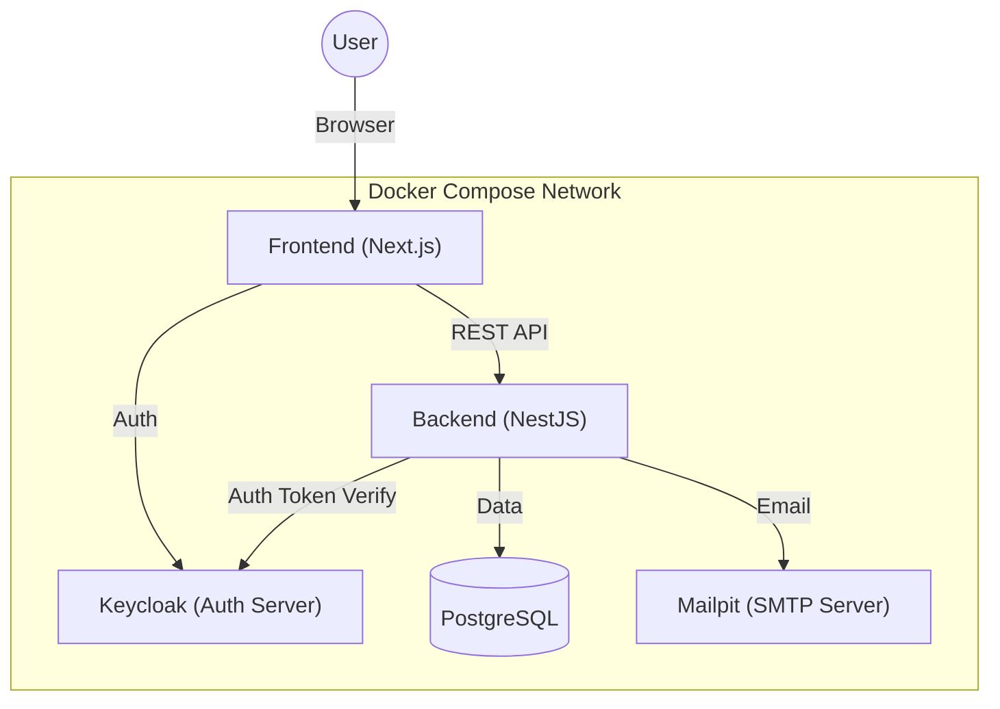

# Flow Craft

**Flow Craft** は、柔軟なフォーム設計とワークフロー制御を可能にする、ノーコード/ローコード指向のモダンなワークフローシステムです。
直感的なUIで申請フォームを作成し、承認フローを視覚的に定義することができます。

## 主な機能

- **フォームデザイナー**: ドラッグ＆ドロップで申請フォームを作成
- **フローデザイナー**: ノードベースのGUIで承認フローを設計
- **ワークフロー実行**: 申請から承認・差戻し・完了までのステータス管理
- **ユーザー管理**: Keycloak連携による認証・認可

## アーキテクチャ

本システムは、フロントエンドとバックエンドを分離したコンテナベースの構成をとっています。



## ディレクトリ構成

- `frontend/`: Next.js によるフロントエンドアプリケーション
- `backend/`: NestJS によるバックエンド API アプリケーション
- `keycloak/`: 認証サーバー設定
- `docker-compose.yml`: ローカル開発環境の構成定義

## クイックスタート

Docker と Docker Compose がインストールされている必要があります。

1. リポジトリをクローンします。
2. コンテナを起動します。

```bash
docker-compose up
```

起動後、以下のURLで各サービスにアクセスできます。

- **Frontend**: http://localhost:3000
- **Backend API**: http://localhost:8080
- **Keycloak**: http://localhost:8081
- **Mailpit**: http://localhost:8025

詳細なセットアップ手順や開発方法は、各ディレクトリの README を参照してください。

- [Frontend README](./frontend/README.md)
- [Backend README](./backend/README.md)

## ライセンス

[MIT License](./LICENSE)
