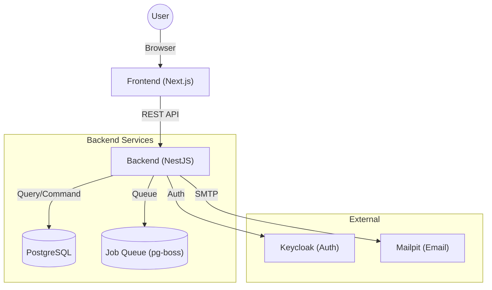

# Flow Craft

**Flow Craft** は、柔軟なフォーム設計と高度なワークフロー制御を可能にする、モダンなノーコード/ローコード ワークフロープラットフォームです。
直感的なドラッグ＆ドロップ操作で業務アプリを作成し、複雑な承認プロセスも視覚的に定義できます。

## 🚀 主な機能

### 1. フォームデザイナー
- **ドラッグ＆ドロップ**: テキスト、数値、日付、選択肢などのコンポーネントを自由に配置
- **グリッドレイアウト**: 柔軟なレイアウト調整が可能
- **バリデーション**: 必須チェック、文字数制限などをGUIで設定

### 2. フローデザイナー
- **ノードベース編集**: 直感的なGUIで承認フローを設計
- **多彩なノード**: 承認、差戻し、条件分岐、並列処理、API呼び出し等
- **可視化**: 申請の現在地やルートを視覚的に把握

### 3. アプリケーション管理
- **バージョン管理**: フォームとフローの定義をバージョンごとに保存・復元
- **ステータス管理**: 下書き、公開、アーカイブのライフサイクル管理
- **タグ機能**: 用途や部署ごとにアプリを分類・検索

### 4. ワークフロー実行エンジン
- **ステータス遷移**: 定義に基づいた厳密なステータス管理
- **履歴記録**: 誰がいつ何をしたかを全て記録（証跡管理）
- **タスク管理**: ユーザーごとの承認タスク一覧表示

## 🛠 技術スタック

### Frontend
- **Framework**: [Next.js](https://nextjs.org/) (App Router)
- **UI Context**: React
- **Component Lib**: Material UI (MUI)
- **Visual Editors**: 
  - [React Flow](https://reactflow.dev/) (フロー図)
  - [React Grid Layout](https://github.com/react-grid-layout/react-grid-layout) (フォーム配置)
- **State Management**: React Query (TanStack Query)

### Backend
- **Framework**: [NestJS](https://nestjs.com/)
- **Language**: TypeScript
- **Database**: PostgreSQL
- **ORM**: Prisma
- **API Style**: REST API

### Infrastructure
- **Containerization**: Docker / Docker Compose
- **Authentication**: Keycloak (Optional/Integrated)

## 🏗 アーキテクチャ

本システムは、フロントエンドとバックエンドを分離した疎結合なアーキテクチャを採用しています。



## 📦 ディレクトリ構成

- **[frontend/](./frontend/README.md)**: Next.js によるフロントエンドアプリケーション
- **[backend/](./backend/README.md)**: NestJS によるバックエンド API アプリケーション
- `keycloak/`: 認証サーバー設定
- `docker-compose.yml`: ローカル開発環境の構成定義

詳細な設計や開発手法については、各ディレクトリの README を参照してください。

## 🏁 クイックスタート

Docker環境があれば、すぐにローカルで動作確認が可能です。

### 前提条件
- Docker Desktop
- Docker Compose

### 起動手順

1. **リポジトリのクローン**
   ```bash
   git clone <repository-url>
   cd flow-craft
   ```

2. **コンテナの起動**
   ```bash
   docker-compose up -d
   ```
   初回起動時はデータベースの初期化やビルドに数分かかる場合があります。

3. **アクセスの確認**
   - **Frontend**: http://localhost:3000
   - **Backend API**: http://localhost:8080/api
   - **Backend API**: http://localhost:8080/api
   - **Mailpit**: http://localhost:8025 (メール確認用)

### Elasticsearch Mode (Optional)
本システムは、デフォルトのPostgreSQL検索モードに加え、大規模データ向けのElasticsearchモードをサポートしています。

1. **Elasticsearchの起動**
   ```bash
   docker-compose --profile es up -d
   ```

2. **バックエンド設定**
   `backend/.env` (または環境変数) に以下を設定してください。
   ```env
   SEARCH_MODE=elasticsearch
   ELASTICSEARCH_NODE=http://elasticsearch:9200
   ```
   ※ Docker環境でバックエンドと通信する場合、ホスト名は `elasticsearch` となります。

3. **反映**
   バックエンドを再起動すると、新規アプリケーション作成・更新時に自動的にElasticsearchへ同期されます。

## 📝 ライセンス

Copyright (c) 2026 kenichi-33. All rights reserved.   
無断での複製・改変・再配布を禁じます。   
詳細は [LICENSE](./LICENSE) ファイルをご確認ください。   
