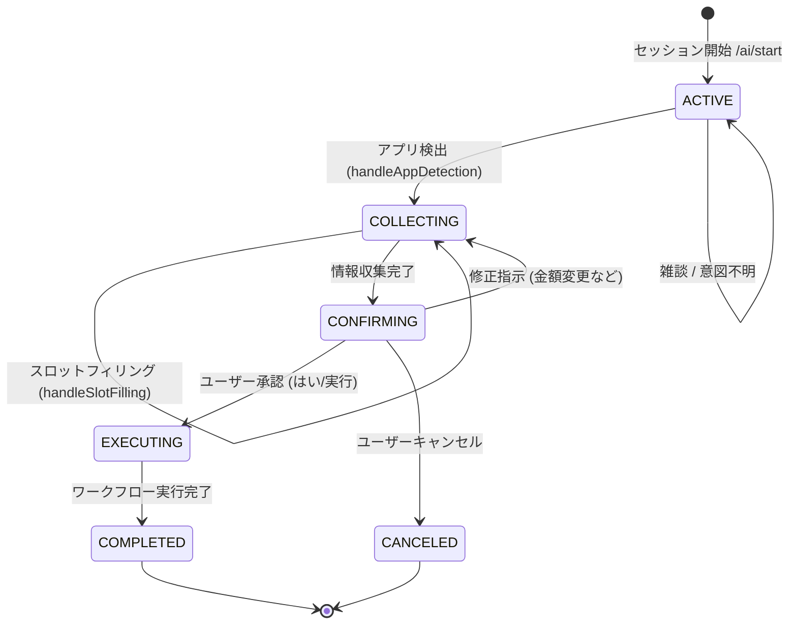
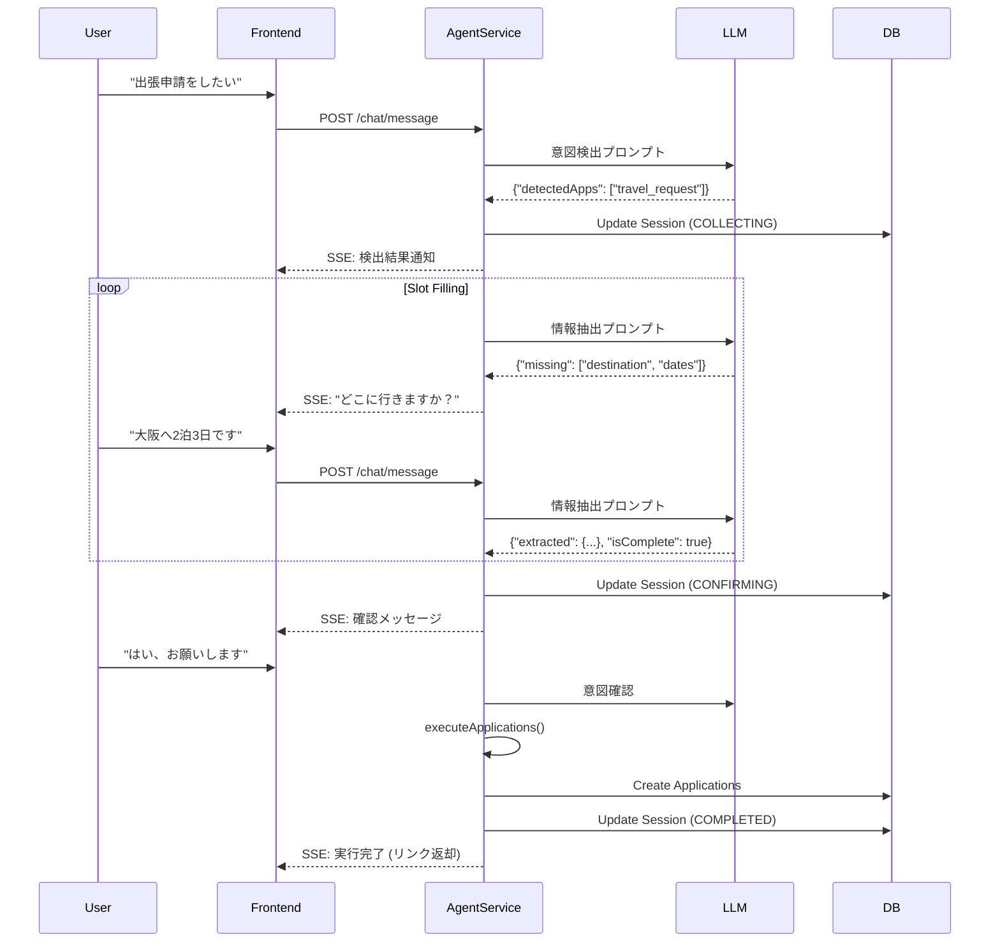
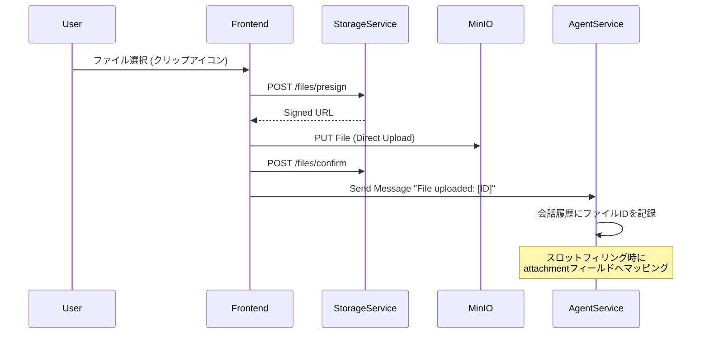

# AI Chat Features Architecture

Flow CraftのAIチャット機能（AI Start Node）に関するアーキテクチャ、データフロー、および設定について記述します。

## 概要

AIチャット機能は、ユーザーが自然言語で対話しながら申請（Application）を作成・実行できる機能です。
単一の申請だけでなく、ユーザーの意図を解析して複数のアプリケーションを同時に検出・実行することが可能です（例：「出張申請と経費精算をしたい」）。

## アーキテクチャ

### コンポーネント構成

```mermaid
graph TD
    User((User)) -->|Chat UI| Frontend[Frontend (React)]
    Frontend -->|SSE Stream| Backend[Backend (NestJS)]
    
    subgraph Backend Services
        Backend -->|Manage Session| AgentService
        AgentService -->|LLM Call| LlmGateway
        AgentService -->|DB Access| Prisma
        AgentService -->|File Check| StorageService
    end
    
    subgraph Infrastructure
        LlmGateway -->|API| OpenAI[OpenAI API]
        LlmGateway -->|API| Ollama[Local Ollama]
        StorageService -->|S3 API| MinIO[MinIO (Object Storage)]
        Prisma -->|SQL| DB[(PostgreSQL)]
    end
```

### ステートマシン

AIチャットセッション（`ConversationSession`）は以下のステートマシンに基づいて動作します。



## データフロー (シーケンス)

### 1. アプリ検出から実行まで



### 2. ファイルアップロード



## データモデル

### ConversationSession

AIチャットの状態を管理するテーブルです。

| フィールド | 型 | 説明 |
| --- | --- | --- |
| `id` | UUID | セッションID |
| `status` | Enum | ACTIVE, COLLECTING, CONFIRMING, EXECUTING, COMPLETED, CANCELED |
| `userId` | String | ユーザー識別子 |
| `history` | JSON | 会話履歴 (User/Assistant) |
| `context` | JSON | LLMコンテキスト |
| `detectedApps` | JSON | 検出されたアプリケーション情報 |
| `slots` | JSON | 収集されたフォームデータ |
| `allowedApps` | String[] | 許可されたアプリケーションID一覧 |
| `applicationId` | String | 生成された親アプリケーションID |
| `childApplicationIds` | String[] | 生成された子アプリケーションID一覧 |

## 環境設定

AIチャット機能の挙動を制御する環境変数です。

| 変数名 | デフォルト値 | 説明 |
| --- | --- | --- |
| `AI_CHAT_MODEL` | `qwen2.5:7b` | チャットで使用するLLMモデル名 |
| `OLLAMA_BASE_URL` | `http://host.docker.internal:11434` | Ollamaのエンドポイント |
| `OPENAI_API_KEY` | (なし) | OpenAI使用時のAPIキー |

## 機能詳細

### 1. 型自動変換
`AgentService` はフォーム定義 (`FormDefinition`) の型情報を参照し、LLMが抽出したテキストデータを適切な型 (`number`, `integer`, `boolean`, `string`) に自動変換して `slots` に保存します。

### 2. 修正指示への対応
確認フェーズ (`CONFIRMING`) において、ユーザーが「はい」以外のアクション（例：「金額を修正して」）を行った場合、エージェントはそれを修正指示と捉え、スロットフィリングを再実行して情報を更新します。

### 3. ファイルアップロード
チャットインターフェースからファイルをアップロードできます。アップロードされたファイルは `StorageService` を介してオブジェクトストレージに保存され、そのIDがフォームの `attachment` や `file` 型フィールドに自動的にマッピングされます。


