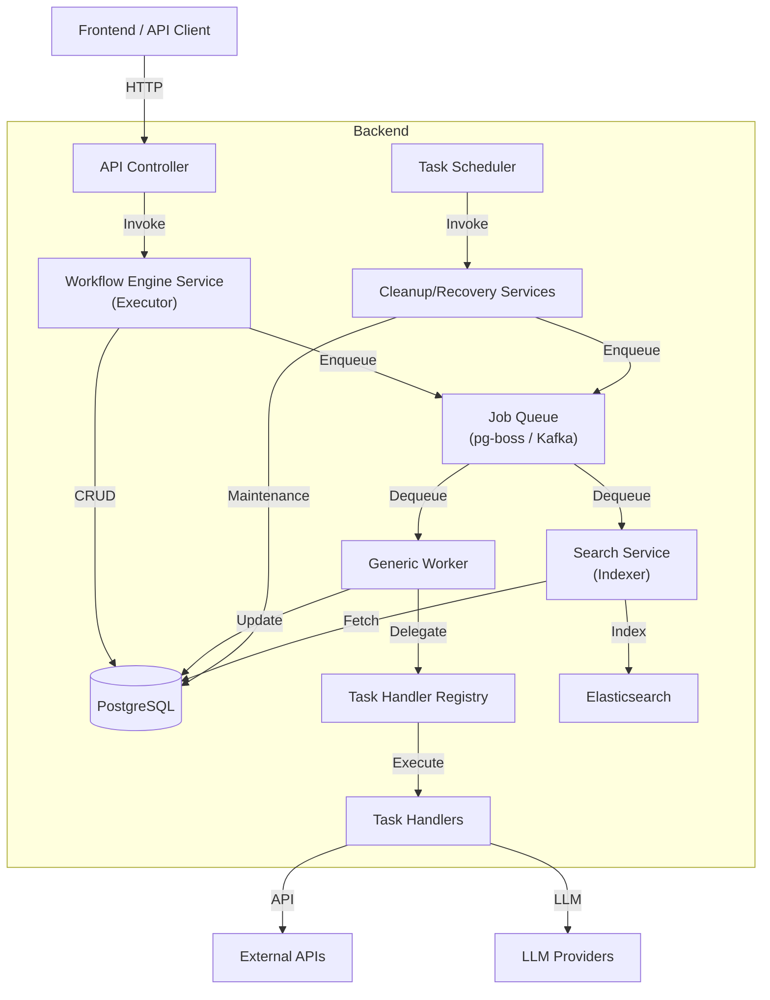

# バックエンド アーキテクチャ

NestJS による Modular Monolith 構成を採用しています。
APIサーバー機能に加え、非同期処理を行う Worker や定期実行を実行する Scheduler が同居する構成となっています。

## システム構成要素

## 主要モジュール

### 1. Workflow Engine Module (`src/modules/workflow-engine`)
ワークフロー実行の中核を担うモジュールです。

- **WorkflowEngineService (Executor)**: 
  - フロー定義に基づき、次のステップを決定する「司令塔」。
  - `WORKFLOW_NODE_PROCESS` ジョブを処理し、必要なタスク (`WorkflowTask`) をDBに作成して `TASK_EXECUTE` キューを発行します。
  - `TASK_COMPLETE` ジョブを処理し、タスク完了後のフロー遷移（`advanceToNextNode`）を実行します。
  
- **GenericWorker (Worker)**: 
  - 非同期タスクの「実行者」。`TASK_EXECUTE` キューを処理します。
  - `nodeType` に応じた Handler に処理を委譲し、その結果 (`success`, `shouldAdvance`) を `TASK_COMPLETE` キューとして返却します。
  
- **TaskHandlers**:
  - Workerから呼び出される具体的な処理ロジック。
  - `ApprovalHandler`: メール送信のみを行い、承認判定は行いません (`shouldAdvance: false`)。
  - `ApiCallHandler`: APIリクエストを実行し、完了を報告します (`shouldAdvance: true`)。

### 2. Queue Module (`src/modules/queue`)
非同期処理基盤を提供します。

- **PgBossQueueAdapter**: PostgreSQLベースのジョブキュー `pg-boss`。
- **KafkaAdapter**: Kafkaを使用した高スループット対応アダプタ。`QUEUE_TYPE` 設定で切り替え可能。
- **QueueService**: アプリケーション層からキューへのアクセスを抽象化。

### 3. Search Module (`src/modules/search`)
全文検索およびインデクシング機能を提供します。

- **SearchService (Indexer)**:
  - `application-indexing` ジョブを購読し、非同期でインデックス更新（登録・削除）を行います。
  - `ApplicationsService` での作成・更新時にジョブがエンキューされます。
- **Adapters**:
  - **ElasticsearchSearchService**: Elasticsearch に対するインデックス操作と検索。
  - **PostgresSearchService**: PostgreSQL に対する検索（インデックス不要モード）。

### 4. Application Recovery Service (`src/modules/applications`)
**Scheduler (`@Cron`)** を使用した自己修復機能です。

- **役割**: システム障害やワーカーのダウンにより、処理が途中でスタックした（`IN_PROGRESS` だが `PENDING` タスクがない）アプリケーションを検知し、自動的に再エンキューします。
- **頻度**: 5分ごとに実行。

### 5. Storage Module (`src/modules/storage`)
ファイルアップロードとクリーンアップを管理します。

- **StorageService**: S3/MinIO へのファイル操作。
- **StorageCleanupService**: 定期実行 (`3:00 AM`) により、期限切れの一時ファイルや、紐付けされなかった孤立ファイルを削除します。

## データフロー

1. **同期処理**: APIリクエスト（申請作成、タスク完了など）は、最小限のDB更新を行い、重い処理はキューに積んで即レスポンスを返します。
2. **非同期処理**: Workerがジョブを拾い、ハンドラーを通じて処理を実行。結果はDB（`workflow_tasks`, `workflow_task_histories`）に保存されます。
3. **結果整合性**: フローの遷移は非同期で行われるため、クライアントはポーリングまたはWebSocket（将来拡張）で状態を確認します。
