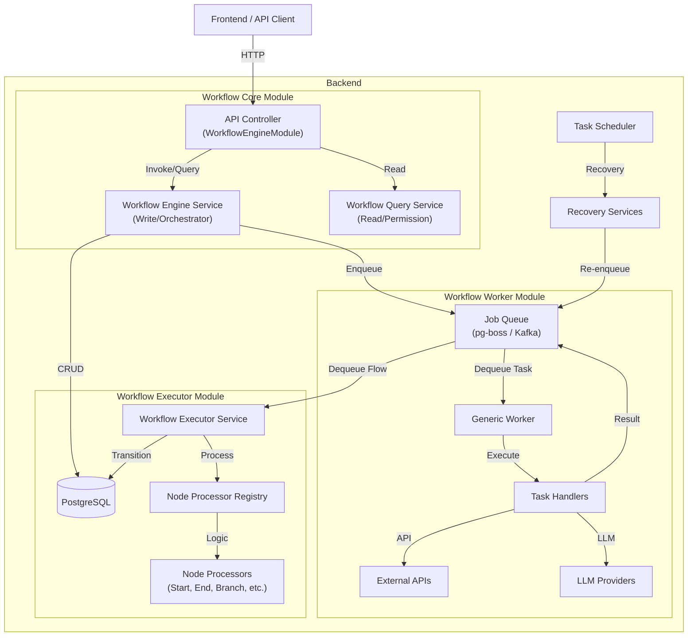

# バックエンド アーキテクチャ

NestJS による Modular Monolith 構成を採用しています。
特徴として、**Core / Worker / Executor** の3層構造を採用し、単一デプロイメントだけでなく、ロールを分離したスタンドアロン展開（Workerモード、Executorモード）をサポートしています。

## システム構成要素

## 主要モジュール構成

### 1. Workflow Engine Modules (`src/modules/workflow-engine`)
スケーラビリティと役割分担のために3つのサブモジュールに分割されています。

#### A. `WorkflowCoreModule` (Core)
全モジュールで共有される基底サービス群を提供します。
- **WorkflowEngineService**: ワークフローの開始、ドラフト保存、タスク完了受付などの書き込み系操作。
- **WorkflowQueryService**: ワークフローの状態取得、ユーザー権限確認などの読み取り系操作。
- **WorkflowHelperService**: 共通ユーティリティ（変数置換、など）。

#### B. `WorkflowWorkerModule` (Worker)
外部システム連携や重い処理を行う「作業者」モジュールです。
- **GenericWorker**: `TASK_EXECUTE` ジョブを処理。
- **TaskHandlers**: `ApiCall`, `LlmCall`, `SendEmail` などの具体的処理。
- **SchedulerWorker**: 定期実行タスクの処理。

#### C. `WorkflowExecutorModule` (Executor)
フローの制御ロジックを担う「進行役」モジュールです。
- **WorkflowExecutorService**: `WORKFLOW_NODE_PROCESS` ジョブを処理。
- **NodeProcessors**: 各ノードタイプ（Start, End, Branch, Parallel, Delayなど）ごとの遷移ロジック。
- **DelayPollService**: 遅延ノード（Delay Node）の再開監視。

### 2. Standalone Deployment Modes
環境変数により、特定のロールのみを有効化して起動可能です。

| モード | 環境変数設定 | 用途 |
| :--- | :--- | :--- |
| **All-in-One** (Default) | (設定なし) | 全機能が有効になります。 |
| **API Server** | `ENABLE_WORKER=false`, `ENABLE_EXECUTOR=false` | HTTPリクエスト受付専用（ジョブ処理を行わない）。 |
| **Worker** | `ENABLE_API=false`, `ENABLE_EXECUTOR=false` | Workerジョブのみを処理（HTTPサーバーなし）。 |
| **Executor** | `ENABLE_API=false`, `ENABLE_WORKER=false` | Executorジョブのみを処理（HTTPサーバーなし）。 |

### 3. Queue Module (`src/modules/queue`)
非同期処理基盤を提供します。
- **PgBossQueueAdapter**: PostgreSQLベースのジョブキュー。
- **KafkaAdapter**: Kafkaを使用した高スループット対応。

### 4. Search Module (`src/modules/search`)
- **SearchService**: インデックス更新（Elasticsearch / Postgres）。

### 5. Application Recovery Service (`src/modules/applications`)
- **自己修復**: システム障害やメッセージ損失によりスタックしたアプリケーションを検知し、自動的に復旧（再エンキュー）します。
