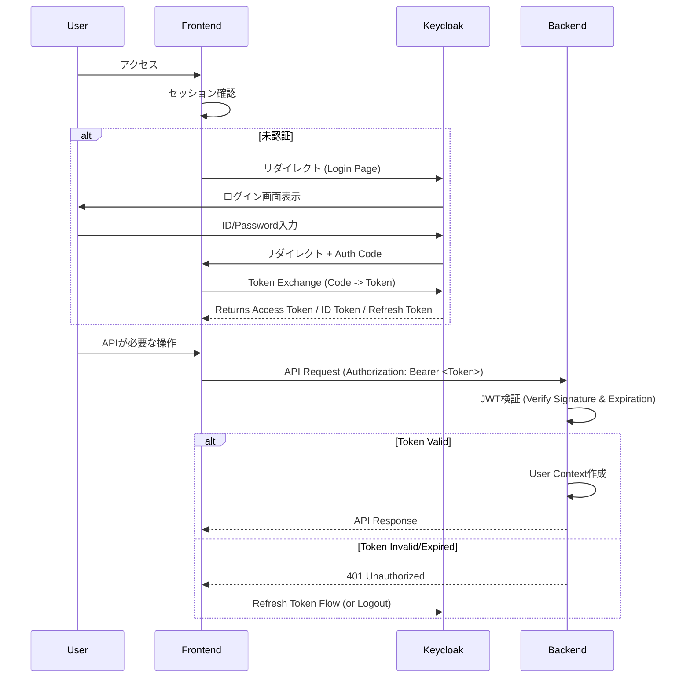

# バックエンド認証・認可設計

Flow Craftは、認証基盤として **Keycloak** を利用し、標準的な OIDC / OAuth2 フローを採用しています。バックエンドAPIはアクセストークン（JWT）の検証のみを行い、ユーザー情報の管理やパスワード検証はKeycloakに委譲しています。

## 認証フロー

## JWT (JSON Web Token) 設計

アクセストークンに含まれる主なクレーム情報は以下の通りです。バックエンドはこれらの情報を用いて認可制御を行います。

| クレーム名 | 説明 | マッピング |
| --- | --- | --- |
| `sub` | ユーザー一意識別子 (UUID) | Keycloak User ID |
| `preferred_username` | ログインID | `user.username` |
| `email` | メールアドレス | `user.email` |
| `name` | フルネーム | `user.name` |
| `given_name` | 名 | `user.firstName` |
| `family_name` | 姓 | `user.lastName` |
| `realm_access.roles` | ロール一覧 | `user.roles` (例: `wf_admin`, `wf_user`) |
| `groups` | 所属グループ一覧 | `user.groups` (例: `/Sales/Section1`) |
| `groupCodes` | 部署コード一覧 | `user.groupCodes` (例: `SALES_DEPT`) |

### ロール設計

Keycloak上で以下のRealm Roleを定義し、APIのGuardとして利用します。

- **`wf_admin`**: システム管理者。全APIへのアクセスが可能（チーム管理、アプリ定義公開など）。
- **`wf_manager`**: アプリケーション管理者。アプリ定義の作成・編集が可能。
- **`wf_approver`**: 承認権限を持つユーザー。
- **`wf_user`**: 一般ユーザー。申請と自分のタスクの閲覧のみ。

### グループ設計

階層構造を持つグループ（部署など）をサポートします。
例: `/Company/Division/Section`
これらはタスクの割り当て先（`AssignedTo`）として利用されます。

## 実装詳細

- **Strategy**: `PassportStrategy(Strategy, 'jwt')` (`src/auth/strategies/jwt.strategy.ts`)
- **Validation**: `jwks-rsa` を使用してKeycloakの公開鍵セット(JWKS)を動的に取得・キャッシュし、署名を検証します。
- **Guard**: `JwtAuthGuard` をグローバルまたは個別のルートに適用。
