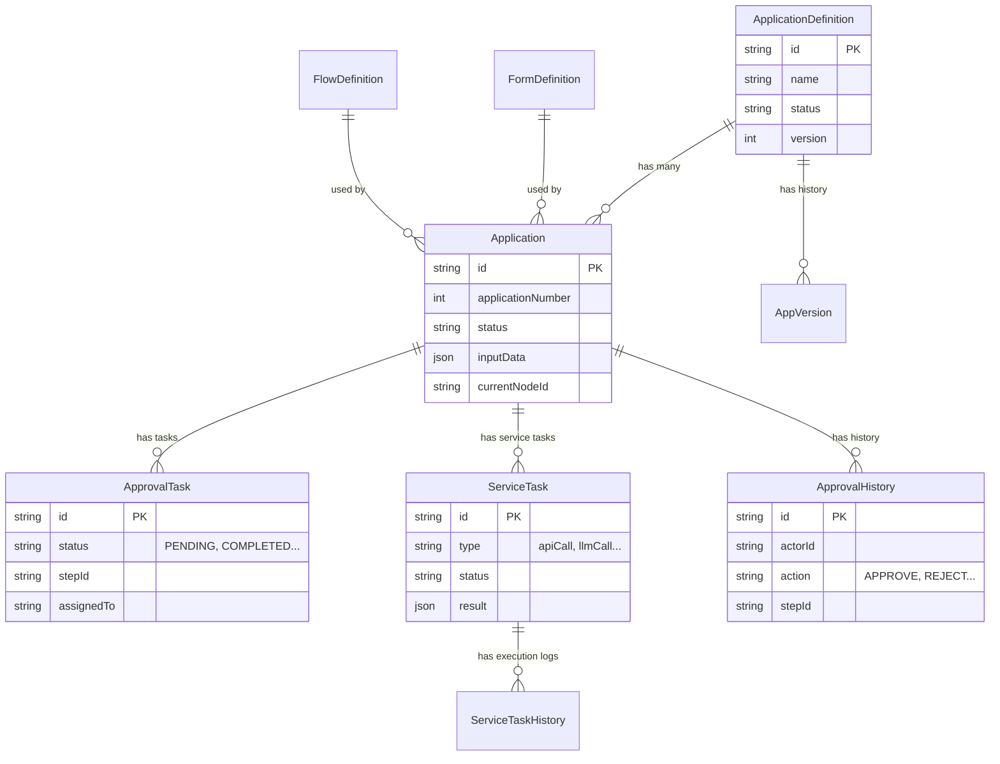

# データベーススキーマ

主要なエンティティの関係図 (ER図) です。

## テーブル概要

| テーブル名 | 説明 |
| --- | --- |
| **application_definitions** | 申請アプリの定義（メタデータ）。 |
| **applications** | 個別の申請インスタンス。入力データ(`input_data`)と現在の状態を保持。 |
| **approval_tasks** | ユーザーに割り当てられた承認タスク。 |
| **service_tasks** | APIコールやAI処理などのシステム自動実行タスク。 |
| **approval_histories** | ユーザーによる承認・却下のアクション履歴。 |
| **form_definitions** | フォームのスキーマ定義 (RJSF形式)。 |
| **flow_definitions** | フローのノード・エッジ定義 (ReactFlow形式)。 |
