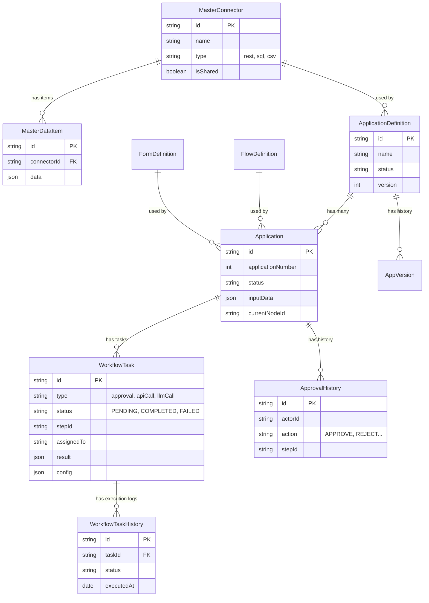

# データベーススキーマ

主要なエンティティの関係図 (ER図) です。
(Legacy: ApprovalTask/ServiceTask は WorkflowTask に統合されました)

## テーブル概要

| テーブル名 | 説明 |
| --- | --- |
| **application_definitions** | 申請アプリの定義（メタデータ）。 |
| **applications** | 個別の申請インスタンス。入力データ(`input_data`)と現在の状態を保持。 |
| **workflow_tasks** | フロー実行タスクの統合テーブル。承認タスク(`approval`)とシステムタスク(`apiCall`, `llmCall`等)を一元管理。 |
| **workflow_task_histories** | システムタスクの再試行履歴や実行ログ。 |
| **approval_histories** | ユーザーによる承認・却下のアクション履歴（監査ログ的役割）。 |
| **form_definitions** | フォームのスキーマ定義 (RJSF形式)。 |
| **flow_definitions** | フローのノード・エッジ定義 (ReactFlow形式)。 |
| **master_connectors** | 外部システム連携設定。`isShared`による共有設定や、作成・更新者の監査情報(`createdBy`, `updatedBy`)を保持。 |
| **master_data_items** | CSV連携タイプの場合のインポートデータレコード。 |

## スナップショット機能

`applications` テーブルは、申請時点のフォーム定義(`form_schema`)やフロー定義(`flow_nodes`)をスナップショットとして保持します。
これにより、アプリケーション定義が更新されても、過去の申請は作成時点の状態を忠実に再現して表示することが可能です。
