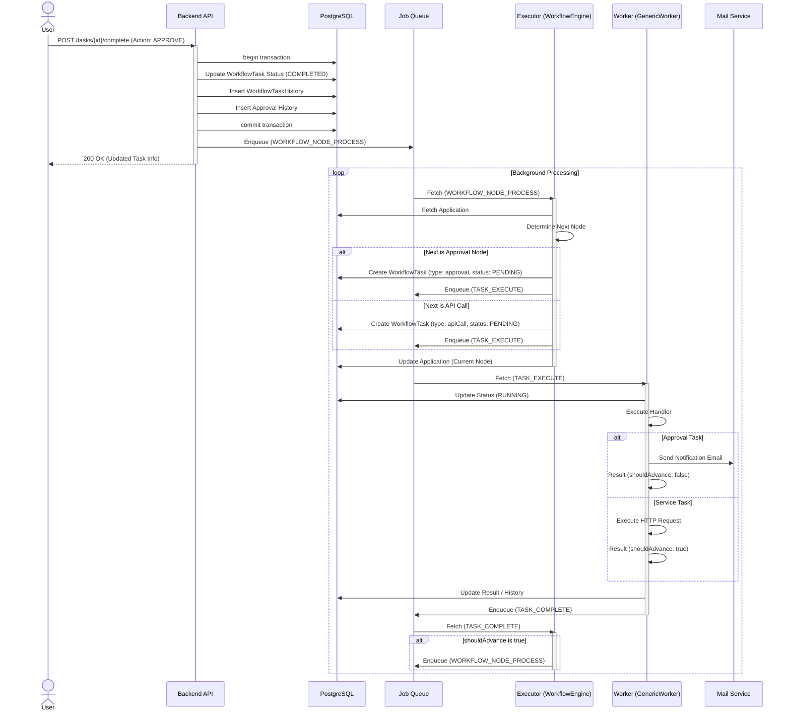
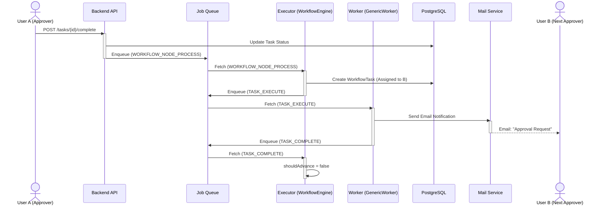
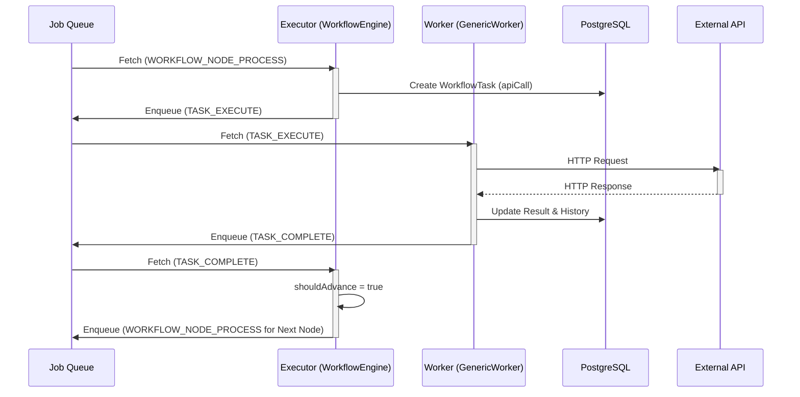
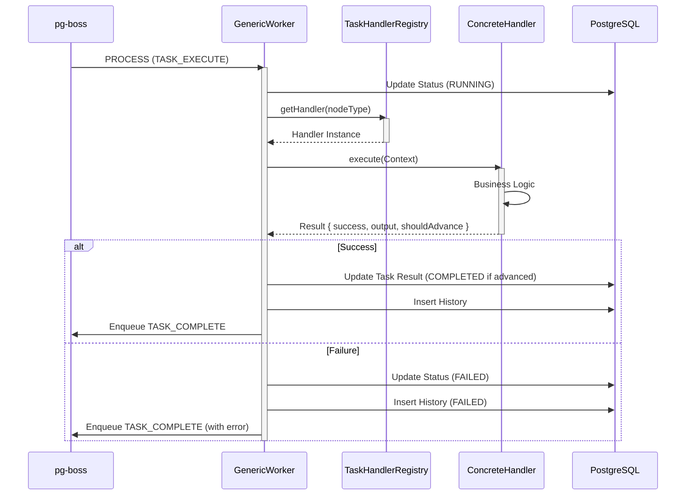
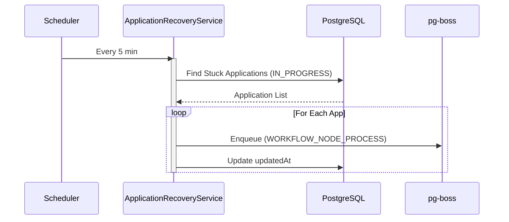
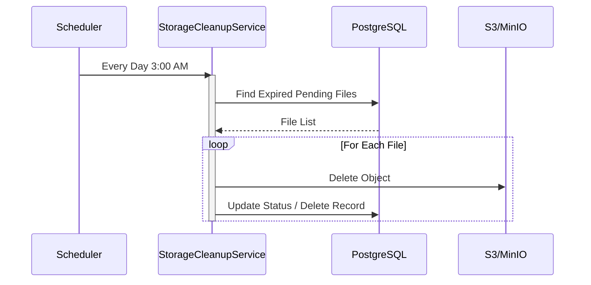
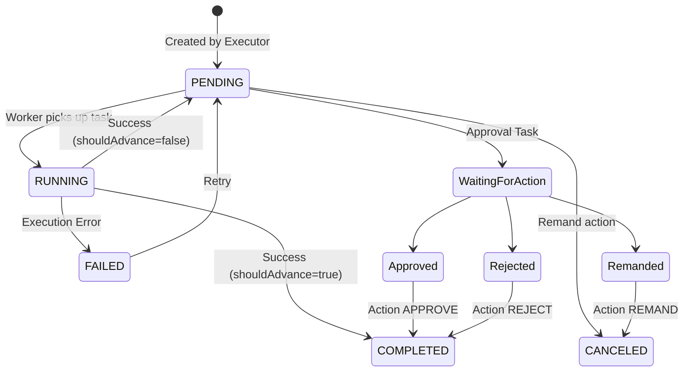
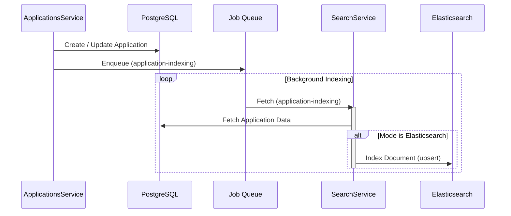

# シーケンス図

## ワークフロー承認プロセス (非同期)

ユーザーがタスクを「承認」し、次のステップへ進むまでの流れを示します。
Executor (WorkflowEngine) がフロー制御を行い、Worker (GenericWorker) が個別のタスク処理を実行する役割分担となっています。

## ヒューマンタスク間遷移 (承認 -> 次の承認)

承認者(A)の承認により、次の承認者(B)のタスクが生成される詳細フローです。

## 自動API実行タスク (Service Task)

APIコールノードに到達した際の処理フローです。

## Generic Worker 内部フロー

GenericWorker がジョブを受信してから完了させるまでの詳細フローです。

## Scheduler: アプリケーションリカバリー

## Scheduler: ストレージクリーンアップ

## タスクステータス遷移フロー

`WorkflowTask` のライフサイクルとステータス遷移を示します。

## アプリケーション同期 (検索インデックス)

Elasticsearch へのデータ同期は、アプリケーションの作成・更新イベントをトリガーとして非同期で行われます。

