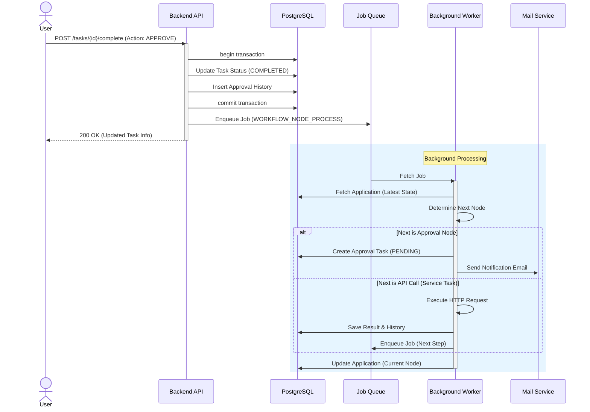
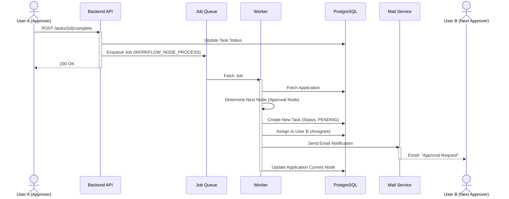
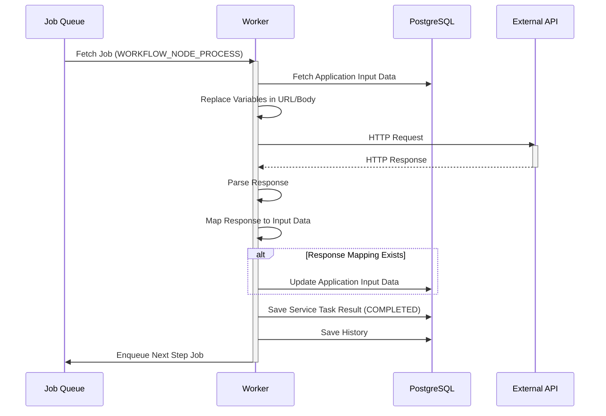

# シーケンス図

## ワークフロー承認プロセス (非同期)

ユーザーがタスクを「承認」し、次のステップへ進むまでの流れを示します。

## ヒューマンタスク間遷移 (承認 -> 次の承認)

承認者(A)の承認により、次の承認者(B)のタスクが生成される詳細フローです。

## 自動API実行タスク (Service Task)

APIコールノードに到達した際の処理フローです。

