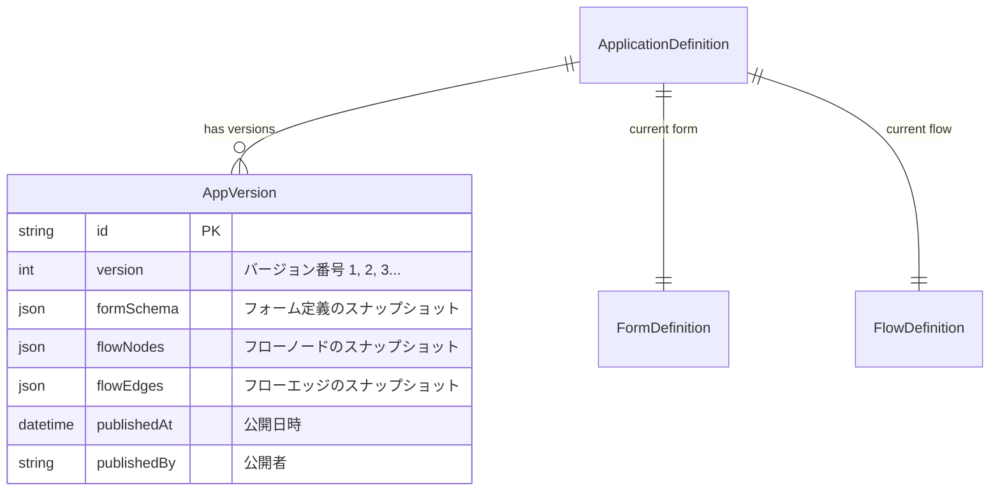

# アプリケーションバージョン管理

Flow Craftでは、申請アプリケーション定義（フォーム定義とフロー定義の組み合わせ）の変更履歴を管理し、運用中のトラブル対応やロールバックを容易にするためのバージョン管理機能を提供しています。

## データモデル

## バージョニングの仕組み

### 1. ドラフト編集 (Active Editing)
ユーザーがデザイナー画面でフォームやフローを編集している間は、`ApplicationDefinition` および関連する `FormDefinition`, `FlowDefinition` のエンティティが直接更新されます。この状態は `DRAFT` (または前回のACTIVE状態) であり、即座に新規申請には影響しません（申請画面は常にACTIVEな定義を参照するため）。

### 2. 公開 (Publishing)
「公開」アクションを実行すると、以下の処理が行われます。

1. **バージョン番号のインクリメント**: `ApplicationDefinition.version` を +1 します。
2. **スナップショット作成**:
   現在の `FormDefinition.schema` と `FlowDefinition` (nodes/edges) をコピーし、新しい `AppVersion` レコードを作成します。
3. **ステータス更新**: `ApplicationDefinition.status` を `ACTIVE` に更新し、`publishedAt` を記録します。

### 3. バージョン復元 (Restore)
過去のバージョンに戻す必要がある場合、「復元」アクションを実行します。

1. **スナップショットの取得**: 指定された `AppVersion` から `formSchema` と `flowNodes/Edges` を取得します。
2. **現在の定義を上書き**: `FormDefinition` と `FlowDefinition` をスナップショットの内容で更新します。
3. **新規バージョンとして公開**:
   単純に過去のバージョン番号に戻すのではなく、**「復元された状態」を「最新バージョン」として**再度公開処理を行います。
   例: v1 -> v2 -> (v2に問題発生) -> Restore v1 -> **v3 (Content of v1)**

これにより、常に最新のバージョン番号が一意に現在の稼働状態を表すようになります。

## 申請データとの関係

各申請 (`Application`) レコードは、**申請時点での定義のスナップショット** を保持しています (`formSchema`, `flowNodes`, `flowEdges`)。
これにより、申請後に定義が変更されても、進行中の申請は整合性を保ったまま（申請時のフローとフォームで）プロセスを完了させることができます。
