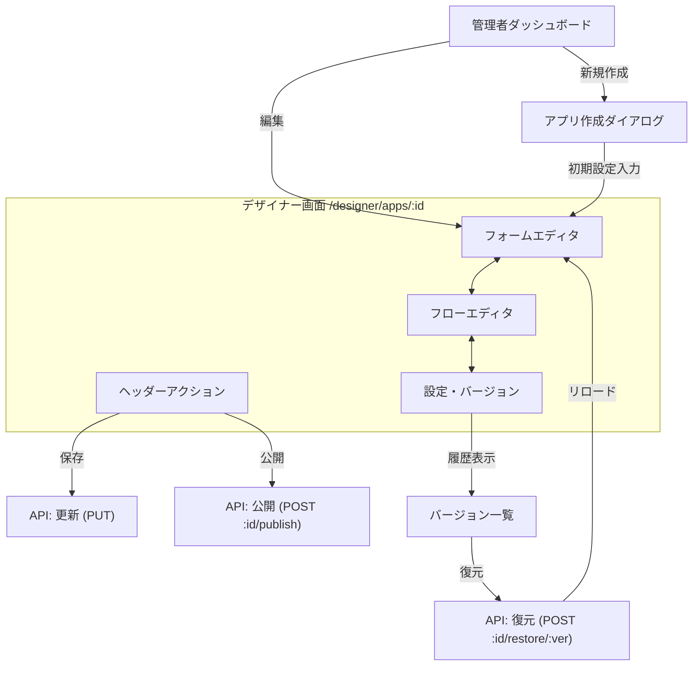

# アプリケーション管理フロー

フロントエンドにおけるアプリケーション定義の作成、編集、公開、およびバージョン管理の流れについて記述します。

## 画面遷移と操作フロー

## 詳細フロー

### 1. 新規作成
1. Adminメニューまたはダッシュボードから「新規作成」をクリック。
2. アプリ名と説明を入力。
3. 作成ボタン押下で `POST /application-definitions` をコール。
4. 作成されたアプリのデザイナー画面へ遷移。

### 2. 編集と保存
- **フォーム編集**: 左側のコンポーネントパレットからフィールドをドラッグ＆ドロップ。プロパティパネルで詳細設定。
- **フロー編集**: ノードを追加し、承認ルートを接続。承認者や条件を設定。
- **下書き保存**: エディタ画面の「下書き保存」ボタン、または詳細画面の「保存」ボタンをクリックすると、現在の状態がサーバーに送信されます (`PUT /application-definitions/:id` など)。
  - *Note*: この時点ではまだ「下書き」扱いであり、一般ユーザーの新規申請（本番運用）には反映されません。常に最後に公開されたバージョンが使用されます。

### 3. アプリ公開 (Publish)
定義を本番環境（一般ユーザー向け）に反映させる操作です。

1. デザイナー画面右上の「新バージョン公開」ボタンをクリック。
2. 確認ダイアログで「公開する」を選択。
3. `POST /application-definitions/:id/publish` をコール。
4. 成功すると、バージョン番号が更新され、一般ユーザーが新しい定義で申請できるようになります。

### 4. バージョン管理・復元
「設定・バージョン」タブで履歴を確認・操作できます。

1. **履歴確認**: `GET /application-definitions/:id/versions` で取得した過去のバージョン一覧を表示（バージョン番号、公開日時、公開者）。
2. **プレビュー**: (将来機能) 過去バージョンのフォームやフローを読み取り専用で確認。
3. **復元**: 任意のバージョンを選んで「このバージョンを復元」をクリック。
   - `POST /application-definitions/:id/restore/:version` をコール。
   - バックエンドにより、そのバージョン内容が現在のドラフトとして上書きされ、即座に**新しいバージョンとして**再公開されます。
   - 画面がリロードされ、復元された内容（＝最新状態）が表示されます。
