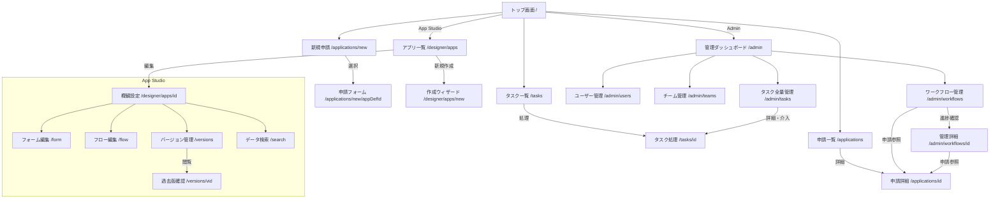

# フロントエンド画面要件・レイアウト定義 (Frontend Requirements)

本ドキュメントでは、Flow Craft アプリケーションのフロントエンドにおける画面機能、レイアウト、およびデザイン要件を定義します。

## 0. 画面遷移図 (Screen Transition)

---

## 1. 権限とアクセス制御 (Permissions)

フロントエンドでは、Keycloakから取得したロールに基づきメニューおよびアクセスを制御します。

| ロール | 役割・権限 | アクセス可能な主要エリア |
| :--- | :--- | :--- |
| **wf_user** | **利用者** 一般的な申請・タスク処理を行う。 | ・トップ (`/`) ・新規申請 (`/applications/new`) ・申請一覧 (`/applications`) ・タスク (`/tasks`) |
| **wf_approver** | **承認者** 承認業務を行う権限を持つ（wf_userの上位）。 | (Userの全機能) ・タスク一覧での承認アクション ※現状はwf_userとUI上の大きな差分はないが、承認権限の有無で区別される。 |
| **wf_manager** | **設計者・管理職** アプリの作成・編集、および組織内の全申請状況の確認が可能。 | (Approverの全機能) ・App Studio (`/designer/apps`) ・管理ダッシュボード (`/admin`) ・ワークフロー管理 (`/admin/workflows`) ・タスク管理 (`/admin/tasks`) |
| **wf_admin** | **システム管理者** 上記に加え、システム設定・ユーザー・チーム管理が可能。 | (Managerの全機能) ・ユーザー管理 (`/admin/users`) ・チーム管理 (`/admin/teams`) |

---

## 2. 共通レイアウト (Common Layout)

### 2-1. メインレイアウト (`AppLayout`)
App Studio **以外** の全画面で適用されます。
*   **サイドバー**: ロールに応じてメニュー項目をフィルタリング表示。
    *   **利用者**: トップ, 新規申請, 申請一覧, タスク
    *   **設計者**: アプリ管理 (Manager以上)
    *   **管理者**: ダッシュボード, 進捗一覧, タスク管理 (Manager以上) + チーム, ユーザー (Adminのみ)
*   **ヘッダー**: ロゴ、ロールバッジ(承認者/管理職/管理者)、ユーザーアイコン・メニュー。

### 2-2. App Studio レイアウト
`/designer/apps/[id]` 配下は `AppLayout` を無効化し、独自のレイアウトを適用（キャンバス領域を最大化するため）。
*   **ヘッダー**: 簡易ヘッダーまたはツールバーを表示。
*   **ナビゲーション**: タブまたは戻るボタンベースの遷移。

---

## 3. アプリケーション利用画面 (User Screens)

### 3-1. トップ画面 (`/`)
*   **ヒーローセクション**: ユーザーへの挨拶。
*   **クイックアクション**: 権限に応じたカードを表示（「新規申請」「タスクを確認」「アプリを作成」など）。

### 3-2. 新規申請 (`/applications/new`)
*   **アプリ選択一覧**: 公開中(`ACTIVE`)のアプリ定義をカード形式で表示。
*   **検索**: アプリ名、説明、タグでフィルタリング。
*   **遷移**: カード選択 -> 申請フォーム (`/applications/new/[appDefId]`)

### 3-3. 申請フォーム (`/applications/new/[appDefId]`)
*   **構成**:
    *   ヘッダー: アプリ名・説明
    *   ステップバー: 入力 -> 確認 -> 完了
    *   **フロー可視化**: 申請後の承認ルートをプレビュー表示(Read-only)。
    *   **フォーム本体**: `DynamicFormRenderer` による動的フォーム描画。
    *   **アクション**: 「下書き保存」「申請する」。下書き後は申請詳細へ遷移。

### 3-4. 申請詳細 (`/applications/[id]`)
*   **情報表示**: 申請ID, ステータス, 申請者情報, 作成日時。
*   **フォーム内容**: 申請時のデータを Read-only で表示。
*   **フロー進捗**: 現在位置(`currentNodeId`)と通過済みルート(`history`)を可視化。
*   **承認履歴**: タイムライン形式で承認/却下/コメントを表示。

### 3-5. タスク一覧 (`/tasks`)
*   **タブ**: 「未完了(Pending)」「完了済み(Completed)」
*   **一覧項目**: 件名, アプリ名, ステップ名, 発生日。
*   **検索**: 件名・アプリ名・申請者で検索。

### 3-6. タスク処理 (`/tasks/[id]`)
*   **表示内容**: 申請詳細と同様の情報（フォーム、フロー、履歴）。
*   **アクションエリア**: 担当者のみに表示。
    *   **コメント入力**: 必須/任意設定可。
    *   **操作ボタン**: 承認(Approve), 却下(Reject), 差戻し(Remand)。
    *   ※差戻しは「申請者まで」戻し、ステータスを `REMANDED` に変更。

---

## 4. App Studio (Application Designer)

### 4-1. アプリ一覧・作成 (`/designer/apps`, `/designer/apps/new`)
*   **一覧**: 作成済みアプリ定義の管理。ステータス(DRAFT/ACTIVE)でフィルタ。
*   **新規作成ウィザード**: 名前と説明を入力して枠を作成 -> 概観設定へ遷移。

### 4-2. 概観設定 (`/designer/apps/[id]`)
*   **基本情報**: 名前, 説明, タグ編集。
*   **ステータス変更**: DRAFT(下書き) <-> ACTIVE(公開) <-> ARCHIVED(アーカイブ)。
*   **サマリー**: フォームフィールド数、ノード数の確認と各エディタへのリンク。

### 4-3. フォームエディタ (`/designer/apps/[id]/form`)
*   **レイアウト**: 3ペイン構成 (ツールボックス / キャンバス / プロパティ)。
*   **機能**: ドラッグ&ドロップでの配置、Grid Layoutによる位置・サイズ調整。
*   **プレビュー**: モーダルで実際の入力動作を確認可能。

### 4-4. フローエディタ (`/designer/apps/[id]/flow`)
*   **レイアウト**: ReactFlowベースのキャンバス。
*   **バリデーション**: 保存時に構造チェック（開始/終了ノード有無、接続整合性など）を実行。
*   **ノード設定**: 承認ノードの担当者(User/Role/Group/Applicant)、分岐ノードの条件式を設定。

### 4-5. バージョン管理 (`/designer/apps/[id]/versions`)
*   **公開とバージョニング仕様**:
    *   アプリ定義を **「公開(ACTIVE)」** に変更したタイミングで、現在の設定（フォーム・フロー）のスナップショットが作成され、バージョン番号(v1, v2...)が付与されます。
    *   すでにACTIVEなアプリを編集した場合、変更は「ドラフト」として保存され、再度「公開」ボタンを押すことで新バージョン(vX+1)が作成されます。
*   **バージョン一覧画面**:
    *   **履歴表示**: バージョン番号, 公開日時, 公開者, スナップショット統計（フィールド数・ノード数）。
    *   **プレビュー機能 (`OpenInNew`)**: 過去バージョンのApp Studio (Read-onlyモード) を別タブで開き、設定内容を確認可能。
    *   **復元機能 (`Restore`)**: 過去バージョンの設定を **「現在のドラフト」** としてコピー・上書きします。（既存の進行中ワークフローには影響を与えません）

### 4-6. データ検索 (`/designer/apps/[id]/search`)
*   **目的**: 管理者がそのアプリで申請されたデータを横断検索する。
*   **動的検索**: フォーム定義に基づき検索条件（文字列、数値範囲、日付など）を動的に生成。
*   **結果表示**: 動的カラムを持つテーブルで表示。詳細展開で全フィールドを確認可。

---

## 5. 管理画面 (Admin Console)

### 5-1. 管理ダッシュボード (`/admin`)
*   **統計**: アプリ総数、タスク滞留数などのKPI表示。
*   **ショートカット**: 各管理機能へのリンク。

### 5-2. ワークフロー管理 (`/admin/workflows`)
*   **目的**: 全申請のモニタリング。
*   **一覧**: 申請ID, アプリ名, 申請者, ステータス, 現在ステップ。
*   **詳細遷移**:
    1.  **システム詳細 (`/admin/workflows/[id]`)**: 管理者用ビュー。フロー図と履歴、フォームデータ(Read-only)を表示。
    2.  **ユーザー詳細 (`/applications/[id]`)**: 一般ユーザーと同じビューを確認する場合に使用。

### 5-3. タスク全量管理 (`/admin/tasks`)
*   **目的**: 停滞タスクの発見と強制介入。
*   **一覧**: 全ユーザーのタスクを表示。担当者名(Personal/Group)や発生日でソート。
*   **詳細遷移**: `/tasks/[id]` へ遷移し、管理者権限で代理承認などが可能（※現状は本人アクセス制御のみだが、将来的にAdmin介入権限を実装想定）。

### 5-4. ユーザー管理 (`/admin/users`) - Admin Only
*   **情報源**: Keycloak API。
*   **機能**: ユーザー検索、所属グループ・ロール確認（Flow Craft上ではRead-only、編集はKeycloakコンソールへの誘導）。

### 5-5. チーム管理 (`/admin/teams`) - Admin Only
*   **2つの概念**:
    *   **部署 (Departments)**: KeycloakのGroup構造を同期表示。
    *   **チーム (Teams)**: Flow Craft独自の任意グループ。プロジェクト単位などで作成。
*   **機能**: チーム作成、メンバー追加（ユーザー指定/部署指定）。
