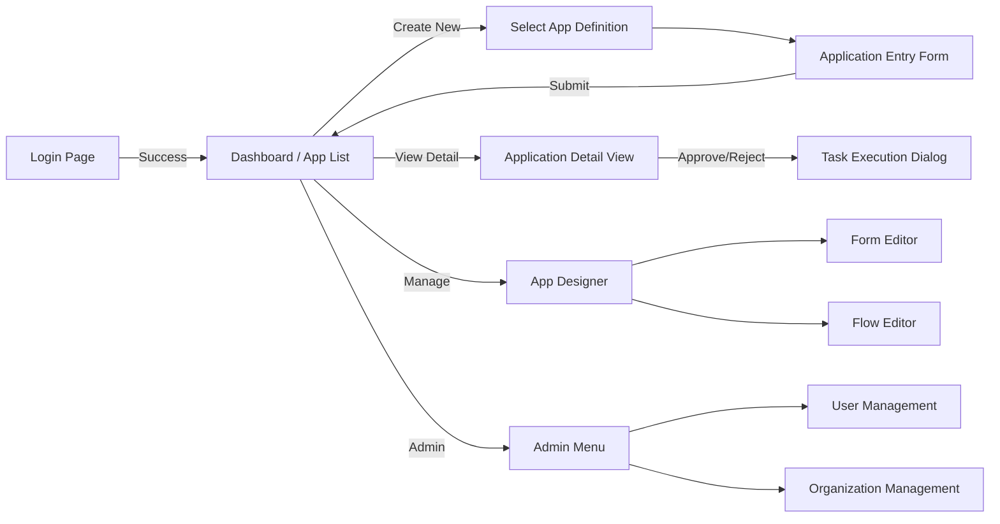

# 画面遷移図

Flow Craft フロントエンドの主要な画面遷移です。

## 主要画面の説明

| 画面名 | パス | 説明 |
| --- | --- | --- |
| **アプリケーション一覧** | `/applications` | ユーザーが閲覧可能な申請の一覧を表示。ステータスによるフィルタリングが可能。 |
| **申請詳細** | `/applications/[id]` | 申請内容、承認フローの進捗、履歴、関連タスクを表示する統合ビュー。 |
| **新規申請** | `/applications/new/[defId]` | 定義されたフォームに基づいて新規申請を行う画面。 |
| **デザイナー** | `/designer/apps` | 管理者が申請アプリ（フォーム＋フロー）を作成・編集する画面。 |
| **タスク一覧** | `/tasks` | ログインユーザーに割り当てられた未完了タスクの一覧。 |
