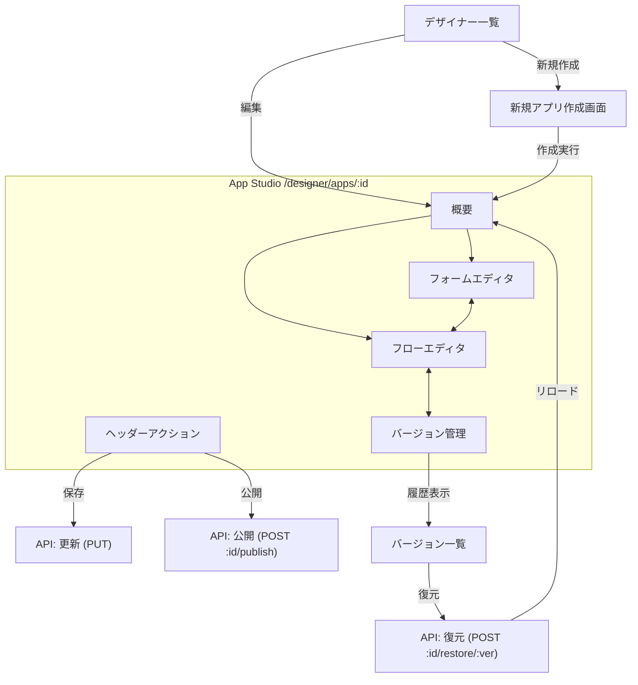

# アプリケーション管理フロー

フロントエンドにおけるアプリケーション定義の作成、編集、公開、およびバージョン管理の流れについて記述します。

## 画面遷移と操作フロー

## 詳細フロー

### 1. 新規作成
1. デザイナーメニュー (`/designer/apps`) から「新規アプリ作成」をクリック。
2. `/designer/apps/new` 画面で、アプリ名と初期キー、説明を入力。
3. 作成ボタン押下で `POST /application-definitions` をコール。
4. 成功後、作成されたアプリの App Studio (`/designer/apps/:id`) へ遷移。

### 2. 編集と保存
App Studioでは、以下のコンポーネントを使用して編集を行います。

- **フォーム編集 (`/form`)**: 
  - `FormDesigner` コンポーネントを使用。
  - 左側のツールボックスからフィールドをドラッグ＆ドロップし、プロパティパネルで設定。
- **フロー編集 (`/flow`)**: 
  - `FlowDesigner` コンポーネントを使用。
  - React Flow ベースのキャンバスでノードを接続し、承認ルートを定義。
- **保存**: 
  - ヘッダーの「保存」ボタンをクリックすると、現在の状態（フォームSchemaとフローDefinition）がサーバーに送信されます (`PUT /application-definitions/:id`)。
  - これは「ドラフト（Draft）」状態の更新であり、即座に一般ユーザーに影響を与えることはありません。

### 3. アプリ公開 (Publish)
編集した定義を本番環境（一般ユーザーが利用可能な状態）にする操作です。

1. App Studio ヘッダーの「公開」ボタンをクリック。
2. 確認ダイアログを経て `POST /application-definitions/:id/publish` をコール。
3. バックエンドでは、現在のドラフト状態の内容をスナップショットとして保存し、バージョン番号をインクリメントします。
4. 新しいバージョンが `ACTIVE` となり、以降の新規申請はこのバージョンに基づいて行われます。

### 4. バージョン管理・復元
「バージョン管理」タブ (`/versions`) で履歴を確認・操作できます。

1. **履歴確認**: 過去のバージョン一覧（公開日時、公開者）を表示。
2. **プレビュー**: バージョンをクリックすると、その時点のフォームとフローを `ReadOnly` モードで確認できます（`VersionPreviewPage`）。
3. **復元**: 任意のバージョンを選んで「このバージョンを復元」を実行。
   - `POST /application-definitions/:id/restore/:version` をコール。
   - そのバージョンの内容が現在の「ドラフト」に上書きコピーされます（注: 即座に公開されるわけではなく、ドラフトに戻ります）。
   - その後、必要に応じて修正を加え、再度「公開」することでリリースできます。
