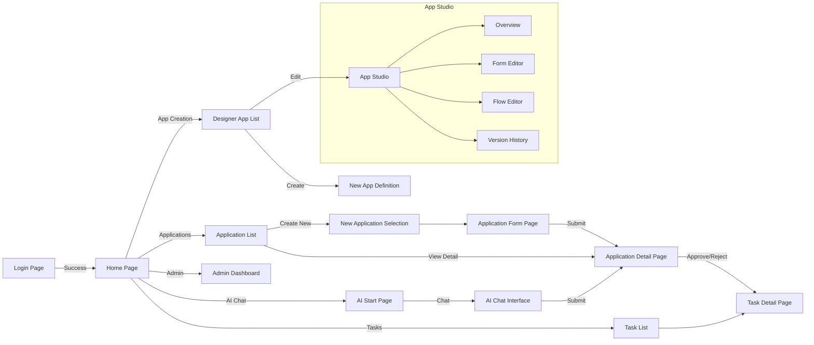

# 画面遷移図

Flow Craft フロントエンドの主要な画面遷移です。

## 主要画面の説明

| 画面名 | パス | ファイルパス (`src/features/.../pages/`) | 説明 |
| --- | --- | --- | --- |
| **ホーム** | `/` | `dashboard/HomePage.tsx` | ダッシュボード。新着タスクや申請へのショートカット。 |
| **アプリケーション一覧** | `/applications` | `applications/pages/ApplicationListPage.tsx` | ユーザーがアクセス可能な申請の一覧。検索・フィルタリング。 |
| **申請詳細** | `/applications/:id` | `applications/pages/ApplicationDetailPage.tsx` | 申請のステータス、フロー進捗、履歴、タスクの統合ビュー。 |
| **新規申請** | `/applications/new/:definitionId` | `applications/pages/ApplicationFormPage.tsx` | 定義されたフォームに基づいて新規申請を行う。 |
| **タスク一覧** | `/tasks` | `tasks/pages/TaskListPage.tsx` | ログインユーザーが担当する未完了タスクの一覧。 |
| **タスク詳細** | `/tasks/:taskId` | `tasks/pages/TaskDetailPage.tsx` | タスクの詳細確認とアクション（承認・却下）の実行。 |
| **AIスタート** | `/ai/start` | `ai/pages/AiStartPage.tsx` | AIチャットの開始点。アプリケーションの自動検出。 |
| **AIチャット** | `/ai/chat/:sessionId` | `ai/pages/ChatPage.tsx` | 会話による情報収集（スロットフィリング）と確認。 |
| **デザイナー（アプリ一覧）** | `/designer/apps` | `designer/pages/DesignerAppsPage.tsx` | 管理者が作成したアプリ定義の一覧。 |
| **App Studio (エディタ)** | `/designer/apps/:id/*` | `layouts/AppStudioLayout.tsx` | アプリ定義の編集を行う統合環境（フォーム、フロー、設定）。 |
